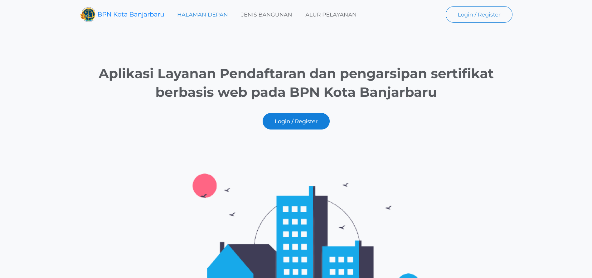
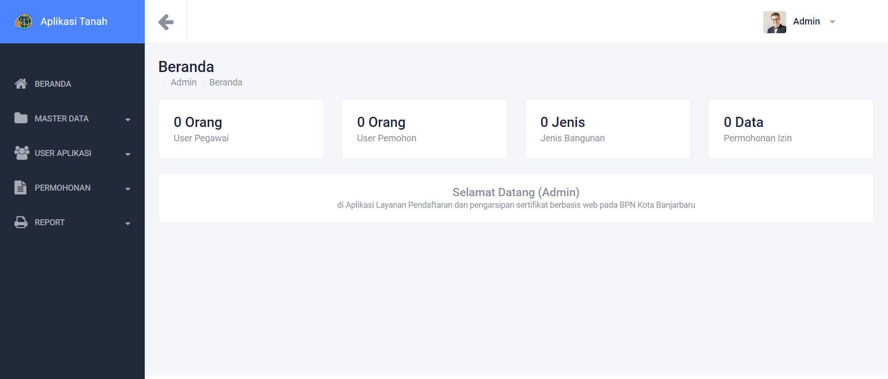

# Sistem Sertifikat Tanah | Laravel + Bootstrap + javascript

Sistem Layanan Sertifikat Tanah Terpadu

## Fitur

- Mobile Responsive Bootstrap Design
- Role User
- permohonan Sertifikat
- Riwayat Tanah
- sertifikat Tanah
- laporan

## Teknologi

**Client:** HTML, CSS, JavaScript, Bootstrap 

**Framework:** PHP, Laravel 

**DataBase:** MySql

## AKSES REPOSITORY

**HALAMAN HALAMAN UTAMA**

**INVENTARIS DASHBOARD**

## Feedback

Berikan feedback atau Ingin Memproleh SourceCode:

**EMAIL DEVELOPER :** 

mikozua45@gmail.com

